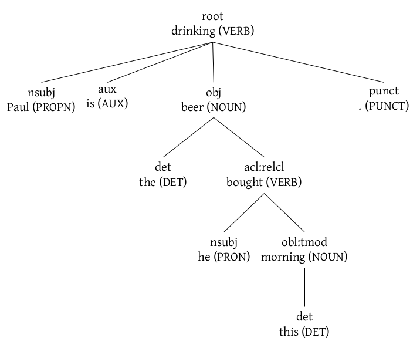
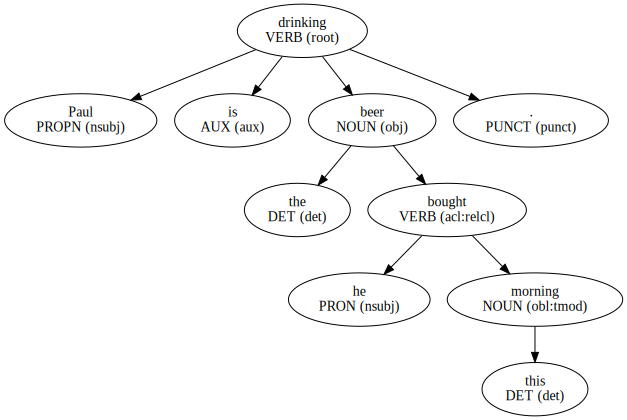
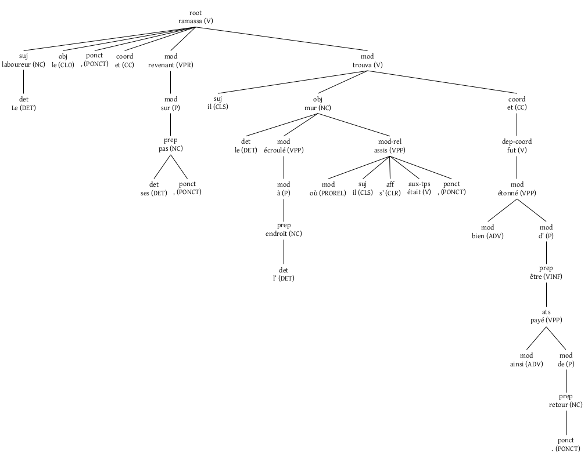
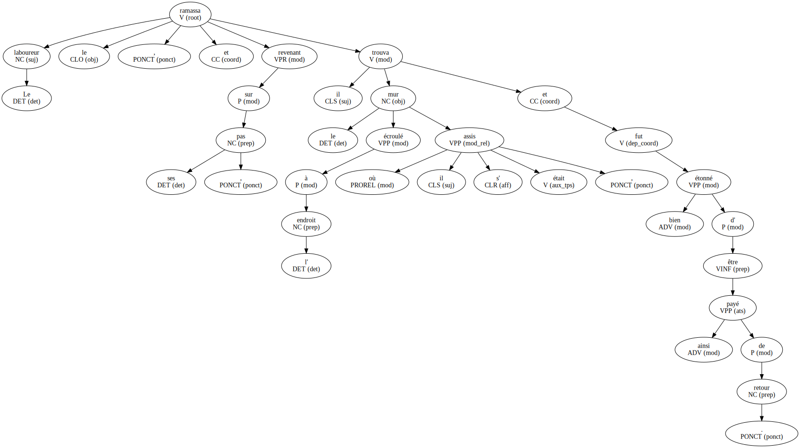

# Dependency to tree

## Introduction

Convert CoNLL output of a dependency parser into a latex or graphviz tree.

For example, here is a sample output form the the [StanfordNLP](https://stanfordnlp.github.io/CoreNLP/):

```
1	Paul	Paul	PROPN	NNP	Number=Sing	3	nsubj	_	_
2	is	be	AUX	VBZ	Mood=Ind|Number=Sing|Person=3|Tense=Pres|VerbForm=Fin	3	aux	_	_
3	drinking	drink	VERB	VBG	Tense=Pres|VerbForm=Part	0	root	_	_
4	the	the	DET	DT	Definite=Def|PronType=Art	5	det	_	_
5	beer	beer	NOUN	NN	Number=Sing	3	obj	_	_
6	he	he	PRON	PRP	Case=Nom|Gender=Masc|Number=Sing|Person=3|PronType=Prs	7	nsubj	_	_
7	bought	buy	VERB	VBD	Mood=Ind|Tense=Past|VerbForm=Fin	5	acl:relcl	_	_
8	this	this	DET	DT	Number=Sing|PronType=Dem	9	det	_	_
9	morning	morning	NOUN	NN	Number=Sing	7	obl:tmod	_	_
10	.	.	PUNCT	.	_	3	punct	_	_
```

And here are the trees using the Latex mode and the GraphViz mode:

<p></p>

<p></p>


Examples of big trees in French (using outputs from Talismane):

<p></p>

<p></p>

Dependency parsers that uses the CoNLL parser includes:

- [StanfordNLP](https://stanfordnlp.github.io/CoreNLP/) (for multiple languages)
- [CoreNLP](https://github.com/stanfordnlp/stanfordnlp) (for multiple languages)
- Talismane (for French)
- MindTheGap (for French)
- ...

## Quick start

There are two modes: Latex or Graphviz.  With the **Latex mode**, all the
sentences will be in a file, each on its own page.  The script produces a
`.tex` file, named according to the -o option, which is compiled if the `-c`
switch is set (otherwise, just run `pdflatex|lualatex <file>.tex`).  To
activate this mode, you must use the the `-l` swith or the `-m latex` option:

For example:

```bash
python3 dependency2tree.py -l -o <output.tex> -c <input.conll>
```

or

```bash
python3 dependency2tree.py -l -o <output.tex> <input.conll>
pdflatex output.tex # or lualatex
```

This will produces a `output.pdf` file containing your trees.


In the GraphViz mode (the default mode), each sentence is in its own file.  If
you don't want to compile, you can get graphviz files with:

```bash
python3 dependency2tree.py -o <output.gv> -c <input.conll>
```

You will get `output-001.gv`, `output-002.gv`, etc. for each sentence. You can
run `dot` to get image files (replace svg by the format you want):

```bash
dot -Tsvg output-001.gv > output-001.svg
```

If you want to compile automatically with the `-c` swith, just adjust the
output file extension to `svg` (or `png`, etc.) instead of `gv`:

```bash
python3 dependency2tree.py -o <output.svg> -c <input.conll>
```

This will get you `output-001.svg`, `output-002.svg`, etc.  You can change the
image format (`png`, etc.) with `-f` option:

```bash
python3 dependency2tree.py -o <output.png> -c -f png <input.conll>
```

For more information, run:

```bash
python3 dependency2tree.py -h
```

